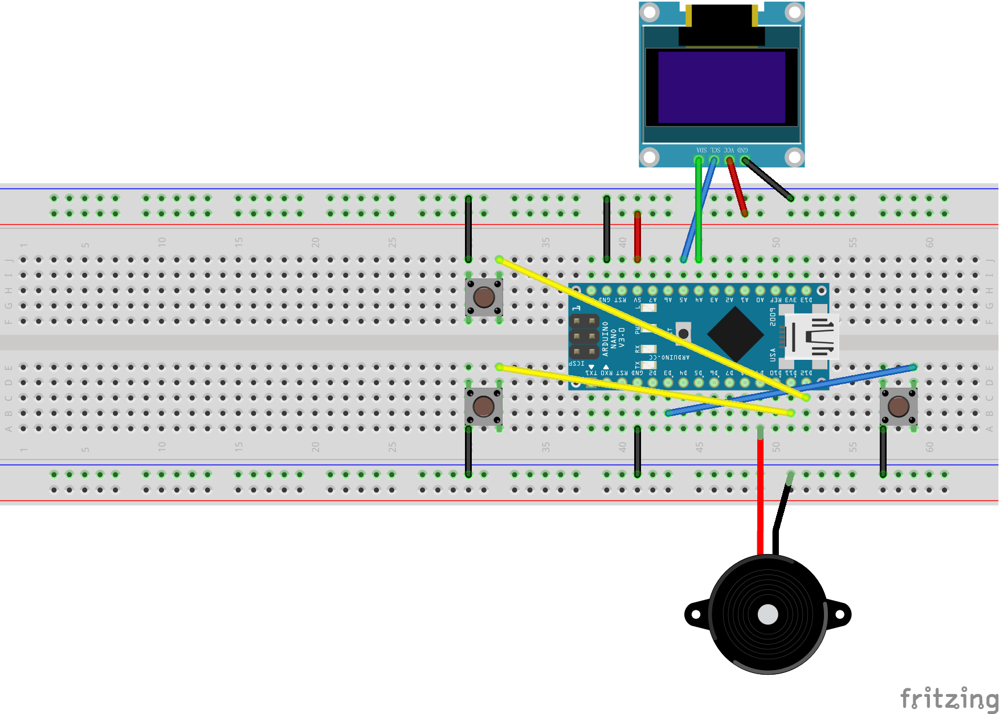

# recreational-machines-Star-Wars
本项目基于arduino开发板进行开发（esp8266），点击gamemain.ino即可运行
所采用的电路布线为“电路图（包含按键与电源）”，详细连接可见“杜邦线连线图.png”
<table style="width:100%">
  <tr>
    <td style="text-align: center;">
      
    </td>
  </tr>
</table>
剩余三个PCB图可做发散参考
